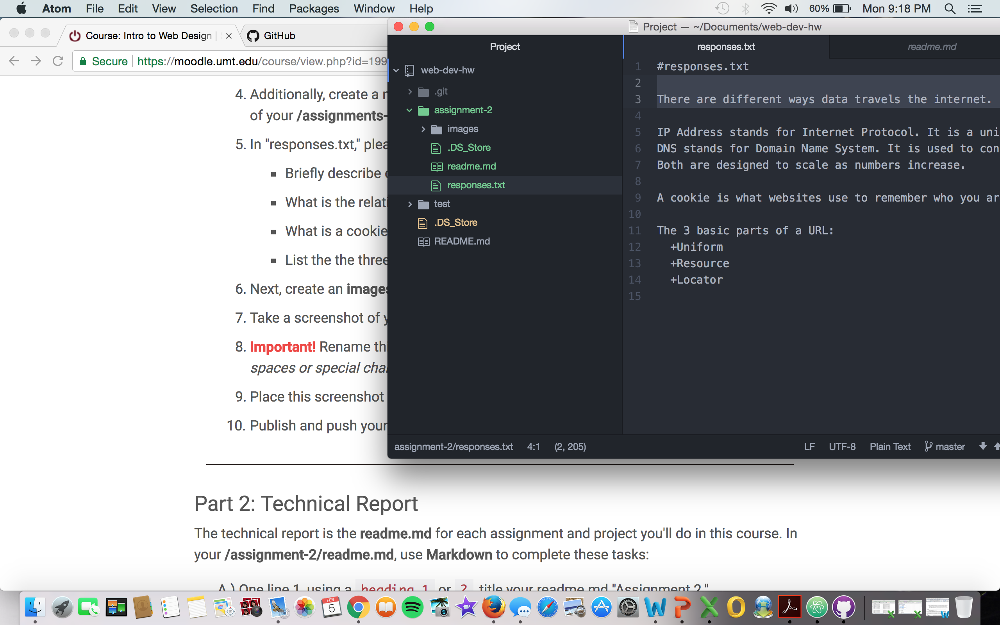

# Assignment 2

A version control system provides clarity to when you did something and why you did something. We use it because it is a fast and modern implementation of version control, provides us with a history of content changes, facilitates collaborative changes to files, and it is easy to use for any type of knowledge worker.

Throughout the week I proceeded to watch multiple videos on how to complete the work for module two. The cheatsheet was a big help, once again. I also began to understand the way each app works and the roles they play in helping develop a web page. Although, I had a rather difficult time getting my screenshot to upload, I now understand the material in this weeks cycle. 

[Here are my responses](../assignment-2/responses.txt)

