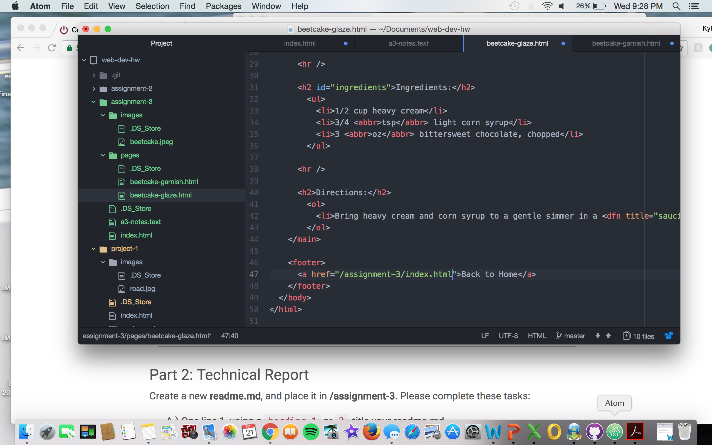

#assignment-3

A page can have up to five head elements in code, however, there is only a need for one head element. The body can have two different elements, which includes structural and/or semantic elements. Both the structural and semantic contain different types of elements that are useful for hyperlinking, strikethroughs or lists you wish to include.

The head element is a container for processing information and document metadata. The head contains high-level information about the site, and always comes first within the root element. the head contains the thoughts of the page. The body element is where all of the information of the site gets placed. This is the data that is rendered by the browser and displayed on the client’s local computer.

Structural markup embeds information about the structure of a document such as, headings, paragraphs, breaks, or lists. Structural markup will help guide a user visually and provide information about the type of content through a document. On the other hand, Semantic Markup is used to reinforce the information in a document. This can be used to identify a word as being strong or to give an emphasis.

My work cycle for this assignment began on a decent pace. As I deepened into the middle of the assignment I began having a little more difficulty, but managed to get through it. It took me longer to complete the end of part I. I thought the footnotes associated with this assignment was interesting to use and thought it went nicely with the webpage. I also enjoy adding pictures to projects to give us a nice illustration and the more I do it, the more I understand the process. Some of the problems posted in the issues board was helpful in completing this assignment. 

