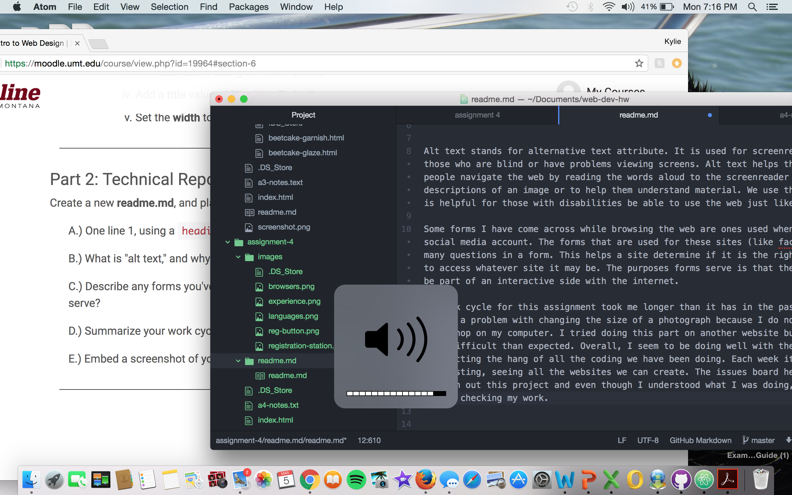

# readme.md

Alt text stands for alternative text attribute. It is used for screenreader's, like those who are blind or have problems viewing screens. Alt text helps those types of people navigate the web by reading the words aloud to the screenreader and by giving descriptions of an image to help them understand the material being shown. We use this because it is helpful for those with disabilities be able to use the web just like the rest of us.

Some forms I have come across while browsing the web are ones used when entering a new social media account. The forms that are used for these sites (like facebook) ask you many questions in a form. This helps a site determine if it is the right user trying to access whatever site it may be. The purposes forms serve is that they help the user be part of an interactive side with the internet.

My work cycle for this assignment took me longer than it has in the past. I came across a problem with changing the size of a photograph because I do not have photoshop on my computer. I tried doing this part on another website but it became more difficult than expected. Overall, I seem to be doing well with the assignments and getting the hang of all the coding we have been doing. Each week it becomes more interesting, seeing all the websites we can create. The issues board helped me along through out this project and even though I understood what I was doing, it was helpful double checking my work.

