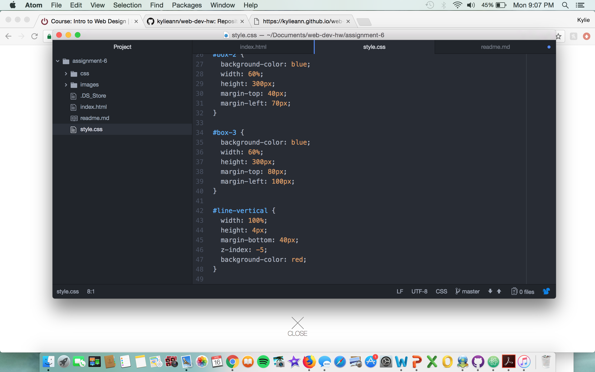

# Assignment 6

My design process for this assignment was based off of the 1990's. I chose a graphics from the 90's because these particular ones reminded me of the childhood cartoons that I used to watch. I tried to style my art page off of these cartoons because they were always full of color and excitement. My early childhood was during the 90's and reflecting back on some of those cartoons made me create and design my page just like someone would have designed one for a cartoon.

My color palette included blue, red and black. I thought these colors were prefect for the main focus and corresponded nicely with 'cartoon' colors. The blue was used for the websites background color, the red was used for the background of the text box, and the black was used for the wording.

My work cycle for this assignment was one of my favorites, so far. I enjoyed creating something from what I used to do when I was a little girl. At first it was confusing, just like any other assignment. I was not sure where I was supposed to code certain aspects, but once I started coding, I was able to work my way through it and understand what I needed to do. I normally have a lot more problems through out my work cycle, but I was able to do this one stress-free, for the most part. I hope I enjoy the next couple of modules we have left, just as much as I enjoyed CSS.

