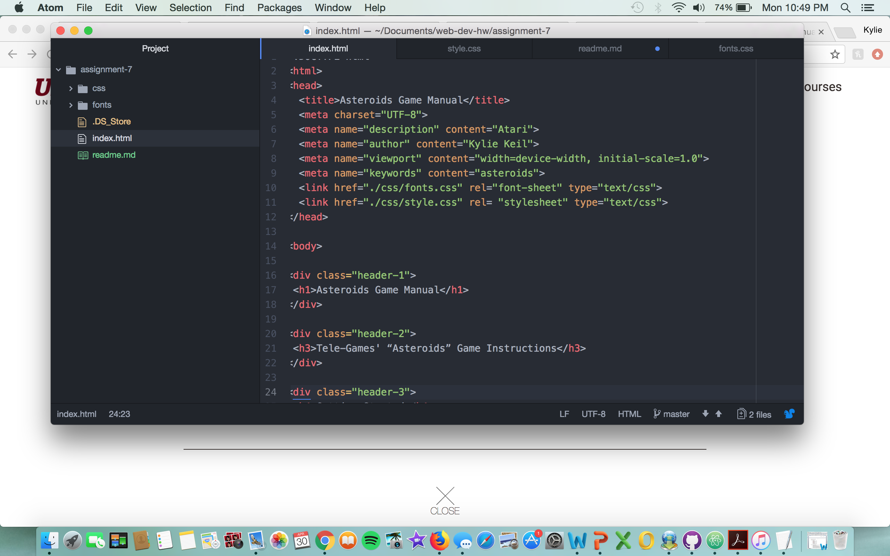

#Assignment 7

The fonts I chose were Cormorant Unicase Regular and Righteous Regular. I chose these two because I loved the way they looked and I felt like they both went with the look I was going for for this assignment which was a computer/video game feel.

The differences between system font, web font and web-safe font is that a system font is mainly for fonts that are supposed to be installed into your computer. A web-safe font is one that is already embedded into the computer like the fonts all of us know and love. For example, these would include fonts like Times New Roman or Helvetica. A web font is a custom font that is recognized by other sites. Also, when these fonts do not work or cooperate, a fallback font will help replace the original font when it does not seem to work. 

My work cycle for this assignment was a little confusing to get started. I had to go over the class materials in more detail than I had originally thought, but once I reread and understood more clearly what was expected, I began to move along with this assignment. I get frustrated when I cannot figure out an element but the materials provided were very helpful in solving my beginning issues.

