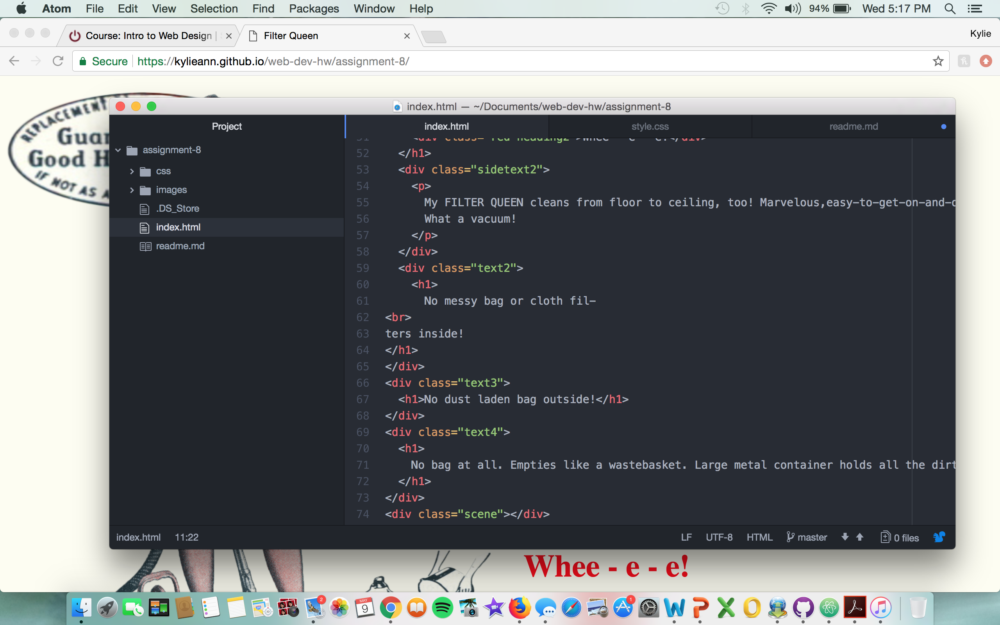

# Assignment-8

The difference between padding, margin, and borders is quite simple.
Padding relates to how much space is between the objects that are inside of a box. This is different than margins because margins deals with how much space is between the box and the everything that is surrounding it. Borders, on the other hand, is the outside or boarders of the boxes on a webpage.

The hardest part of this assignment was trying to figure out the alignment/positioning for the specific elements. It took me a while for it to be placed where it was supposed to go.

I enjoyed the box model for our last assignment. Some parts were difficult to figure out, but just like other web design projects, getting things wrong is how you learn to code. A few things slowed me down while trying to complete this assignment but overall I thought it was a good assignment to end the course on. 

