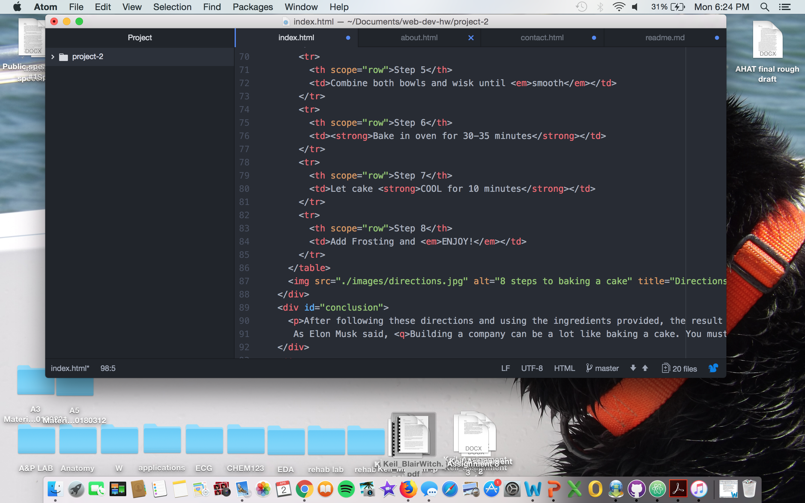

# Project-2

Learning HTML is always an experience. Sometimes I come across problems and other
times I don't. Developing project 2 I cam across some old coding as well and new coding. Some of the old coding consisted of giving the viewer a destination with an address element, email and embedded google map. Some of the new coding consisted of action and method attributes. These were more difficult to comprehend at first but once I got going it was easier to navigate through it.

Beginning CSS and expanding on styling is exciting for me. I am very detailed oriented so being able to learn more about decorating HTML makes me extremely excited. This is probably my favorite aspect of this class and being able to create your own work.

My work cycle for this assignment was frustrating, to say the least. I was able to develop the project and code correctly but when pushing my work onto github, much of the elements did not seem to show up. I corrected many things, with the help of the issues board. I am not able to access all of the pages (home, about and contact), however, It will only work when you click on the link starting from the home page. If you are on About and try to go back to Home, it will say the page doesn't exist. Unfortunately, this becomes a problem when other people try to access it. The URL changes a lot of them time, without any explanation, which might be issues from the website etc. Hopefully next time I will be able to figure out the solution to this issue.

